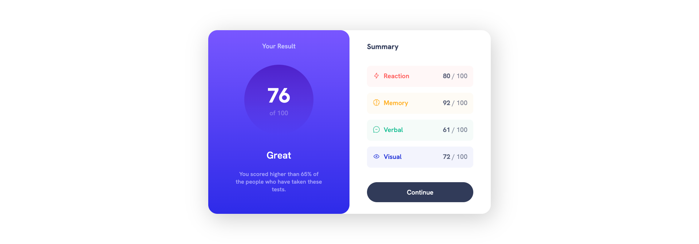

# Frontend Mentor - Results summary component solution

This is a solution to the [Results summary component challenge on Frontend Mentor](https://www.frontendmentor.io/challenges/results-summary-component-CE_K6s0maV). Frontend Mentor challenges help you improve your coding skills by building realistic projects. 

## Table of contents

- [Overview](#overview)
  - [The challenge](#the-challenge)
  - [Screenshot](#screenshot)
  - [Links](#links)
- [My process](#my-process)
  - [Built with](#built-with)
  - [What I learned](#what-i-learned)
  - [Continued development](#continued-development)
  - [Useful resources](#useful-resources)
- [Author](#author)
- [Acknowledgments](#acknowledgments)


## Overview

### The challenge

Users should be able to:

- View the optimal layout for the interface depending on their device's screen size
- See hover and focus states for all interactive elements on the page
- **Bonus**: Use the local JSON data to dynamically populate the content

### Screenshot



### Links

- Solution URL: [Solution URL]()
- Live Site URL: [Live site URL]()

## My process

### Built with

- Semantic HTML5 markup
- CSS custom properties
- Flexbox
- CSS Grid
- Mobile-first workflow
- Vanilla JavaScript

### What I learned

You can set background as linear gradients like so:
```css
background-image: linear-gradient(180deg, red, blue);
```

Box Shadow
```css
box-shadow: 6px 12px 60px 0px red;
/*          pos-x pos-y blur spread color */
```

### Continued development

- Read more about flex-grow | flex-shrink | flex-basis
- Grid Properties
- Improve on vanilla JavaScript as I was unable to use the icons from the JSON file and had to resort to using this unsightly CSS to add icons.

```css
/* Fourth Row */
.summary .row:nth-child(4) {
    background-color: hsl(var(--raw-clr-primary-cobalt-blue), 5%);
}

.summary .row:nth-child(4) .row-title {
    color: var(--clr-primary-cobalt-blue);
}

.summary .row:nth-child(4) .row-title::before {
    content: url(./assets/images/icon-visual.svg);
    display: inline-block;
    padding-right: 10px;
    vertical-align: middle;
}
```

### Useful resources

- [CSS Tricks Flexbox](https://css-tricks.com/snippets/css/a-guide-to-flexbox/)
- [Box Shadow Generator](https://developer.mozilla.org/en-US/docs/Web/CSS/CSS_backgrounds_and_borders/Box-shadow_generator)

## Author

- Website - [Praveen Kumar](praveenkum11.github.io/portfolio)
- Frontend Mentor - [@PraveenKum11](https://www.frontendmentor.io/profile/PraveenKum11)
- Twitter - [@softwheredev](https://twitter.com/softwheredev)
